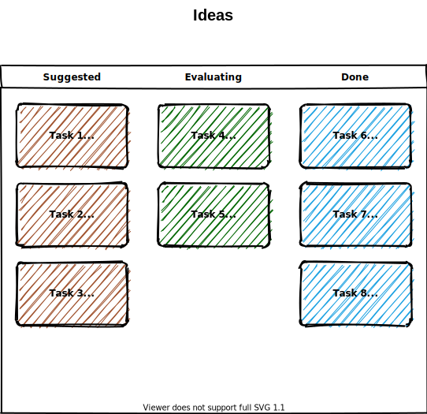
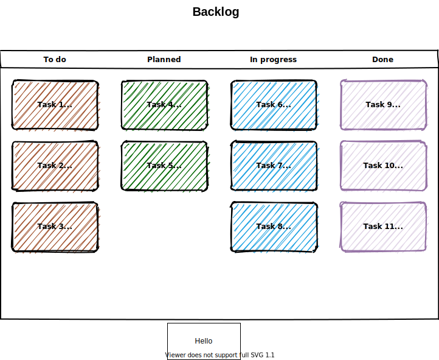
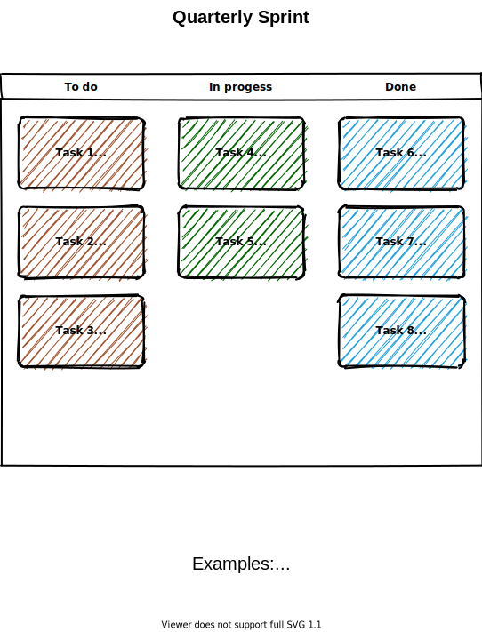

# Example Repo

## [Roadmap](ROADMAP.md)

## [Projects](../../projects)

Core Values
| Core Value | Description |
| ---------- | ----------- |
| All in Flow | Teamwork/Big Picture Thinking - We are not just a software company. We are in the business of seamless solutions. Each decision we make has a cascading effect on our co-workers, our customers, and our company. We make decisions carefully and with the big picture in mind. |
| Untethered Imagination | Innovation/Problem Solving/Thinking Outside the Box - We are not just a software company. We are in the business of solving the unsolvable. The industry is buried in problems too big, too small, or too impossible to solve. We cut through those Gordian knots before our customers ever realize their hands were tied. |
| Comsensitive | Compassion/Empathy/Humor - We are not just a software company. We are in the business of people. We know what our customers go through every day to conduct their business. We know the unique challenges they face. And we handle those issues as if they're our own, because they are. |
| Taming Chaos | Grit/Tenacity/Relentless - We are not just a software company. We are in the business of breakthroughs. We push our partners beyond what they've known. To lead them, we need to be the tip of the spear and razor-sharp. |
| Smart About the Build | Mindful/Thoughtful/"Get It" - We are not just a software company. We are in the business of engagement. We are involved, from the top down, with our customers. We share success. We share innovations. We share attention to detail. We are the structure through which their business flows. |
| Trust the Left Guard | Trust/Reliability - We are not just a software company. We are in the business of trust. Our customers count on us to produce results. We count on our fellow team members to do the same. Accountability is never avoided. |

# GWC - Gets it, Wants it, Capacity to do it
- Debrief customer/internal experts for requests, requirements, etc.
- Liaise with development to communicate issues efficiently
- Define Business System Requirements
- Manage Portfolio of Special Projects
- Refine Product Backlog Items
- Diagnose Procedural Software Issues Escalated from Tier 3
- Contribute to Feature Design

# Rocks
- Help Wayne document his list of special tasks
  - Groom the list, some items may become issues bug fixes or feature requests
- Develop a testing plan with Wayne

# Leadership Assessment
### I am given clear direction.
- Opening created
- A compelling vision communicated
### I am given the necessary tools.
- Resources
- Training
- Technology
- People
- Time and attention
### My manager has let go of the vine.
- Delegated responsibilities to me
- Elevated me to do more of what I am great at
- Has not meddled in the small stuff
### My manager acts with the greater good in mind.
- Company vision (V/TO)
- Their actions
- Their decisions
- They walk the talk
- They put the company's needs first
### My manager takes Clarity Breaks
- To focus "on" the business
- To create clarity
- Takes time consistently

# Management Assessment
### My manager keeps expectations clear.
- Theirs and mine
- I know my Roles, Core Values, Rocks, and Measurables
### My manager communicates well.
- We know what's on each other's minds; there are no assumptions
- There is a good question to statement ratio
### There is a Meeting Pulse.
- Even exchange of dialog
- Reporting measurables
- We are keeping the circles connected
### We have Quarterly Conversations.
Completing the 5-5-5
Using the People Analyzer
### My manager rewards and recognizes.
- I am given positive and negative feedback quickly, within 24 hours
- I am criticized in private, praised in public
- My manager is my boss, not my buddy
- The Three Strike Rule is used

<!--stackedit_data:
eyJoaXN0b3J5IjpbLTM5OTkwOTI0Ml19
-->